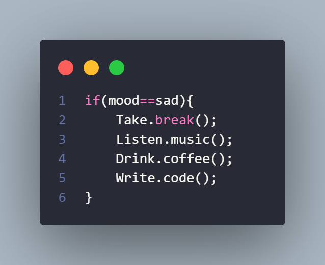
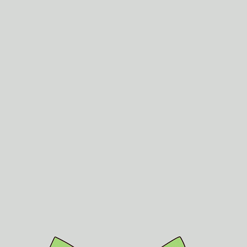

  <h1><b>Hi there 👋, You can call me RXY</b></h1>

  

  
<i>"Coding is like humor. If you have to explain it, it’s bad." – Someone wise</i>

---

### 🛠️ Skills and Tools

  <!-- Core Technologies -->
  
  
  
  
  

  <!-- React Ecosystem -->
  
  
  
  
  
  

  <!-- Other Frameworks and Tools -->
  
  
  
  
  
  
  

---

  <h3>💻 My Coding Philosophy</h3>
  <b>Code like nobody's watching. </b>
  <b>Commit like it’s your last day. </b>
  <b>Push and pray.</b>

---

### 📈 GitHub Stats

  
  

---

  

---

  <i>“Life’s too short to write boring READMEs. Let’s make it fun!”</i>

